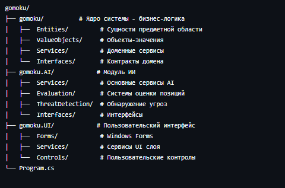
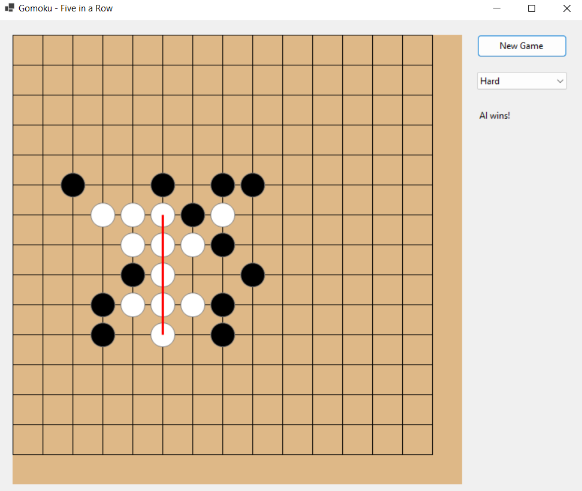

# gomoku

Гомоку — это стратегическая настольная игра, в которой два игрока по очереди выставляют камни на доску. Цель игры — первым построить непрерывный ряд из пяти камней по горизонтали, вертикали или диагонали.

## Структура 

## Игровой процесс

Основные правила:
- Доска: 15×15 клеток

- Игрок: Черные камни (ходят первыми)

- AI: Белые камни

- Цель: Построить ряд из 5 камней

- Направления: Горизонталь, вертикаль, диагонали

Управление:
- Левый клик - поставить камень

- New Game - начать новую игру

- Difficulty - выбрать уровень сложности AI

